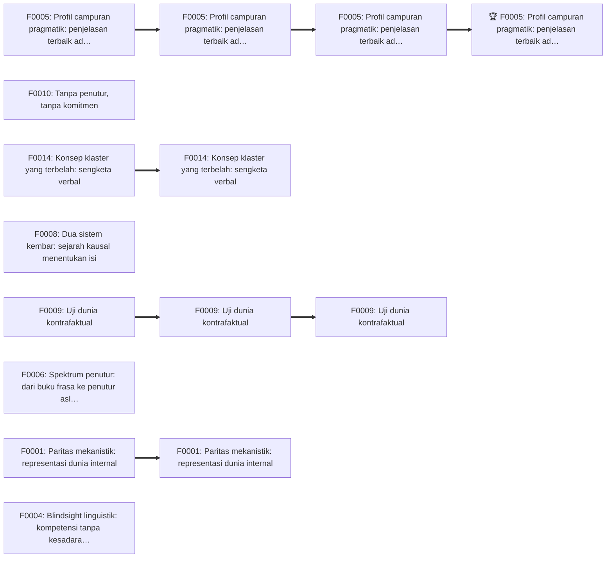

# Laporan Argument Battle Royale

**Topik:** Apakah AI bisa disebut memahami bahasa?  
**Rumusan presisi:** Apakah sistem kecerdasan buatan — khususnya model bahasa besar (LLM) yang ada saat ini, dan sistem AI secara prinsip — dapat secara tepat dikatakan memahami bahasa, dan jika ya, dalam arti 'memahami' yang mana?  
**Dibuat:** 2026-09-29T13:25:32+00:00 · **Mode:** `balanced` · **Populasi target:** 16 · **Seed acak:** 3171064302

> Pemenang adalah argumen yang paling tahan terhadap rubrik pengujian yang diterapkan dalam simulasi ini.

## Cara membaca hasil ini

Hasil turnamen ini **bukan** klaim kebenaran mutlak. Kemenangan menunjukkan ketahanan relatif sebuah argumen terhadap rubrik, protokol, dan populasi lawan dalam simulasi ini — bukan kebenaran metafisik. Argumen lain yang tidak pernah dihasilkan, rubrik lain, atau bukti baru dapat mengubah hasil.

## Ringkasan eksekutif

### 🏆 Pemenang tahan-uji: Profil campuran pragmatik: penjelasan terbaik adalah pemahaman parsial

- **Tesis:** Pola keberhasilan dan kegagalan LLM yang khas — kuat pada semantik literal dan banyak implikatur, rapuh pada komitmen jangka panjang, referensi dunia nyata, dan konsistensi — paling baik dijelaskan oleh hipotesis pemahaman parsial, bukan oleh pemahaman penuh maupun pencocokan pola belaka.
- **Posisi:** Ya secara parsial dan bergradasi · **Kerangka:** Pragmatik & filsafat bahasa sosial
- **Status uji falsifikasi:** `SURVIVED_WITH_DAMAGE`

| Peran | Petarung | Posisi | Unggulan |
|---|---|---|---:|
| Juara bracket | F0005 — Profil campuran pragmatik: penjelasan terbaik adalah pemahaman parsial | Ya secara parsial dan bergradasi | 1 |
| Runner-up | F0009 — Uji dunia kontrafaktual | Tidak untuk AI saat ini, mungkin secara prinsip | 2 |
| Semifinalis | F0014 — Konsep klaster yang terbelah: sengketa verbal | Deflasioner: pertanyaan tidak memiliki jawaban faktual tunggal | 4 |
| Semifinalis | F0001 — Paritas mekanistik: representasi dunia internal | Ya, secara substantif | 3 |

## Parameter run

| Parameter | Nilai |
|---|---|
| `mode` | balanced |
| `population` | 16 |
| `deep_round_threshold` | 8 |
| `max_parallel` | 5 |
| `random_seed` | 3171064302 |
| `evidence_mode` | internal |
| `language` | id |
| `output_dir` | .claude/skills/argument-battle-royale/examples/sample-run |
| `early_method` (profil mode) | llm_single |
| `deep_panel` (profil mode) | 3 |
| `semifinal_panel` (profil mode) | 5 |
| `final_panel` (profil mode) | 5 |
| `falsification_panel` (profil mode) | 2 |
| `gen_batch` (profil mode) | 25 |
| `scout_batch` (profil mode) | 25 |
| `duel_batch` (profil mode) | 20 |
| `dedup_review` (profil mode) | True |
| `max_refill_rounds` (profil mode) | 2 |

**Rubrik & bobot:** Kejelasan konseptual (10), Validitas / kekuatan inferensial (15), Plausibilitas premis (15), Kecukupan empiris (10), Keterujian / falsifiabilitas (10), Ketahanan terhadap kontra-contoh (10), Daya eksplanatoris (10), Parsimoni (5), Koherensi dengan pengetahuan latar (5), Kejujuran dialektis (10).

## Peta ruang argumen

- **Jenis pertanyaan:** `mixed`
- **Presuposisi:** 'Memahami' memiliki kondisi penerapan yang cukup determinat untuk diuji pada sistem non-manusia.; Ada fakta tentang sistem AI (perilaku maupun mekanisme internal) yang relevan bagi benar-salahnya atribusi pemahaman.; Pertanyaan dapat dijawab secara umum untuk 'AI', padahal arsitektur, data, dan cara pelatihan sistem AI sangat beragam.; Pemahaman manusia adalah tolok ukur yang tepat, atau setidaknya titik rujukan, bagi atribusi pemahaman.
- **Posisi:**
  - `S1` **Ya, secara substantif** — Sistem AI seperti LLM kontemporer sudah memahami bahasa dalam arti yang sejenis (meski belum tentu sederajat) dengan manusia: kriteria yang kita pakai untuk manusia — penggunaan inferensial yang sistematis, generalisasi, dan representasi internal yang terstruktur — terpenuhi, sehingga menolak atribusi itu adalah standar ganda.
  - `S2` **Ya secara parsial dan bergradasi** — Pemahaman adalah kapasitas multidimensional. AI kontemporer memiliki dimensi tertentu secara nyata (inferensial, struktural, sebagian referensial melalui data manusia) tetapi lemah atau tidak ada pada dimensi lain (grounding sensorimotor, niat komunikatif, metakognisi yang andal); jawaban ya/tidak biner menyesatkan.
  - `S3` **Tidak untuk AI saat ini, mungkin secara prinsip** — LLM kontemporer hanya mempelajari relasi antar-bentuk tanpa kontak kausal yang tepat dengan referen dan tanpa partisipasi dalam praktik komunikatif, sehingga belum memahami; tetapi tidak ada hambatan prinsipiel bagi sistem AI yang ter-embodied, tergrounding, dan terlibat sosial untuk memahami.
  - `S4` **Tidak, secara prinsip** — Komputasi adalah manipulasi simbol yang didefinisikan secara sintaksis, dan sintaksis saja tidak cukup untuk semantik atau intensionalitas asli; pemahaman membutuhkan sifat-sifat (intensionalitas intrinsik, kesadaran) yang tidak dihasilkan oleh menjalankan program, betapa pun canggih perilakunya.
  - `S5` **Deflasioner: pertanyaan tidak memiliki jawaban faktual tunggal** — 'Memahami' adalah konsep yang dibentuk untuk praktik antarmanusia; penerapannya pada AI tidak ditentukan oleh fakta yang tersembunyi, melainkan oleh keputusan konseptual yang bergantung pada tujuan (sains, etika, hukum). Pertanyaan yang tepat adalah kapasitas spesifik apa yang dimiliki AI dan konsep apa yang paling berguna.
- **Kerangka:** `K1` Fungsionalisme & semantik peran-inferensial; `K2` Grounding simbol & kognisi ter-embodied; `K3` Intensionalitas asli & kesadaran; `K4` Sains kognitif & interpretabilitas mekanistik; `K5` Pragmatik & filsafat bahasa sosial; `K6` Interpretasionisme & epistemologi atribusi mental
- **Strategi:** `M1` Analisis konseptual; `M2` Eksperimen pikiran; `M3` Bukti empiris; `M4` Inferensi ke penjelasan terbaik; `M5` Argumen paritas dan analogi
- **Titik krusial:**
  - Apakah makna dapat muncul dari distribusi bentuk linguistik saja tanpa kontak kausal langsung dengan referen?
  - Apakah pemahaman mensyaratkan intensionalitas asli atau kesadaran fenomenal, atau cukup kapasitas fungsional?
  - Apakah kriteria behavioral (kinerja dan generalisasi lintas tugas) cukup untuk atribusi pemahaman, atau mekanisme internal yang menentukan?
  - Apakah representasi internal LLM tentang entitas dan keadaan dunia merupakan model dunia yang sejati atau korelasi statistik dangkal?
  - Bagaimana menafsirkan kegagalan sistematis (halusinasi, ketidakkonsistenan, kerentanan terhadap perubahan redaksi): bukti ketiadaan pemahaman atau pemahaman yang terbatas?
  - Apakah 'memahami' konsep biner atau bergradasi dan multidimensional?

## Statistik populasi

| Tahap | Jumlah |
|---|---:|
| Petarung dihasilkan | 16 |
| — gelombang 0 (awal) | 16 |
| Duplikat dihapus | 0 |
| Didiskualifikasi (validasi) | 0 |
| Dipotong kapasitas | 0 |
| **Masuk bracket** | **16** |
| Ukuran bracket / bye | 16 / 0 |

| Posisi | Dihasilkan | Masuk bracket |
|---|---:|---:|
| `S1` Ya, secara substantif | 3 | 3 |
| `S2` Ya secara parsial dan bergradasi | 3 | 3 |
| `S3` Tidak untuk AI saat ini, mungkin secara prinsip | 4 | 4 |
| `S4` Tidak, secara prinsip | 3 | 3 |
| `S5` Deflasioner: pertanyaan tidak memiliki jawaban faktual tunggal | 3 | 3 |

## Seeding (16 teratas)

| Unggulan | Petarung | Posisi | Skor scouting | Cacat fatal | Babak terjauh |
|---:|---|---|---:|---:|---|
| 1 | F0005 — Profil campuran pragmatik: penjelasan terbaik adalah pemahaman parsial | Ya secara parsial dan bergradasi | 76.0 | 0 | Juara |
| 2 | F0009 — Uji dunia kontrafaktual | Tidak untuk AI saat ini, mungkin secara prinsip | 73.0 | 0 | Final |
| 3 | F0001 — Paritas mekanistik: representasi dunia internal | Ya, secara substantif | 72.2 | 0 | Semifinal |
| 4 | F0014 — Konsep klaster yang terbelah: sengketa verbal | Deflasioner: pertanyaan tidak memiliki jawaban faktual tunggal | 70.0 | 0 | Semifinal |
| 5 | F0008 — Dua sistem kembar: sejarah kausal menentukan isi | Tidak untuk AI saat ini, mungkin secara prinsip | 68.5 | 0 | Babak 8 besar (Deep review) |
| 6 | F0004 — Blindsight linguistik: kompetensi tanpa kesadaran | Ya secara parsial dan bergradasi | 66.5 | 0 | Babak 8 besar (Deep review) |
| 7 | F0006 — Spektrum penutur: dari buku frasa ke penutur asli | Ya secara parsial dan bergradasi | 65.5 | 0 | Babak 8 besar (Deep review) |
| 8 | F0010 — Tanpa penutur, tanpa komitmen | Tidak untuk AI saat ini, mungkin secara prinsip | 65.0 | 0 | Babak 8 besar (Deep review) |
| 9 | F0002 — Makna sebagai penggunaan: bukti partisipasi komunikatif | Ya, secara substantif | 64.0 | 0 | Babak 16 besar (Eliminasi) |
| 10 | F0015 — Tekstur terbuka: kasus baru, keputusan baru | Deflasioner: pertanyaan tidak memiliki jawaban faktual tunggal | 62.5 | 0 | Babak 16 besar (Eliminasi) |
| 11 | F0003 — Sikap intensional dan pola nyata | Ya, secara substantif | 62.5 | 0 | Babak 16 besar (Eliminasi) |
| 12 | F0007 — Gurita di dasar laut: bentuk tanpa dunia | Tidak untuk AI saat ini, mungkin secara prinsip | 62.5 | 0 | Babak 16 besar (Eliminasi) |
| 13 | F0016 — Bukti pemakaian yang terbelah: memahami sebagai konsep yang sedang dinegosiasikan | Deflasioner: pertanyaan tidak memiliki jawaban faktual tunggal | 62.0 | 0 | Babak 16 besar (Eliminasi) |
| 14 | F0011 — Transduser tidak menyelesaikan masalah grounding | Tidak, secara prinsip | 52.0 | 0 | Babak 16 besar (Eliminasi) |
| 15 | F0013 — Burung beo, rekaman, dan makna-penutur | Tidak, secara prinsip | 51.5 | 0 | Babak 16 besar (Eliminasi) |
| 16 | F0012 — Argumen dari teori kesadaran berbasis struktur kausal | Tidak, secara prinsip | 47.0 | 0 | Babak 16 besar (Eliminasi) |

## Perjalanan bracket

| Babak | Tahap | Metode | Panel | Duel | Upset | Inkonsistensi juri |
|---|---|---|---:|---:|---:|---:|
| Babak 16 besar (Eliminasi) | Eliminasi | `llm_single` | 1 | 8 | 0 | 0 |
| Babak 8 besar (Deep review) | Deep review | `panel` | 3 | 4 | 0 | 0 |
| Semifinal | Semifinal | `panel_debate` | 5 | 2 | 0 | 0 |
| Final | Final | `panel_debate` | 5 | 1 | 0 | 0 |

### Ketahanan posisi per babak

| Posisi | Babak 16 besar (Eliminasi) | Babak 8 besar (Deep review) | Semifinal | Final | Juara |
|---|---:|---:|---:|---:|---:|
| `S1` Ya, secara substantif | 3 | 1 | 1 | 0 | 0 |
| `S2` Ya secara parsial dan bergradasi | 3 | 3 | 1 | 1 | 1 |
| `S3` Tidak untuk AI saat ini, mungkin secara prinsip | 4 | 3 | 1 | 1 | 0 |
| `S4` Tidak, secara prinsip | 3 | 0 | 0 | 0 | 0 |
| `S5` Deflasioner: pertanyaan tidak memiliki jawaban faktual tunggal | 3 | 1 | 1 | 0 | 0 |



## Final 4

### F0005 — Profil campuran pragmatik: penjelasan terbaik adalah pemahaman parsial

- **Posisi:** Ya secara parsial dan bergradasi · **Unggulan:** 1
- **Tesis:** Pola keberhasilan dan kegagalan LLM yang khas — kuat pada semantik literal dan banyak implikatur, rapuh pada komitmen jangka panjang, referensi dunia nyata, dan konsistensi — paling baik dijelaskan oleh hipotesis pemahaman parsial, bukan oleh pemahaman penuh maupun pencocokan pola belaka.
- **Inti keras:** Pemahaman bersifat multidimensional dan bergradasi.; LLM memiliki sebagian dimensi pemahaman secara nyata, bukan semata hafalan.
- **Keberatan berat:**
  - [high/partially_answered] Pengelompokan kegagalan ke dalam 'dimensi' dapat dilakukan setelah melihat data, sehingga prediksi per dimensi tidak benar-benar berisiko.
- **Penilaian penguji:** Argumen ini paling kokoh secara empiris di antara finalis karena menyerap data yang dipakai lawan-lawannya ke dalam satu penjelasan. Titik rawannya konseptual, bukan empiris: 'dimensi' belum dianalisis dan belum dikunci sebelum data dilihat, sehingga keunggulan abduktifnya dapat dituduh post hoc. Jika penyerang berhasil menunjukkan bahwa label 'parsial' tidak memiliki ambang, posisi ini dapat terlihat seperti kompromi yang tidak berisiko. Pembela perlu menunjukkan bahwa dimensi dapat diidentifikasi secara independen dari hasil tugas.

### F0014 — Konsep klaster yang terbelah: sengketa verbal

- **Posisi:** Deflasioner: pertanyaan tidak memiliki jawaban faktual tunggal · **Unggulan:** 4
- **Tesis:** Perselisihan tentang apakah AI memahami bahasa paling baik dijelaskan sebagai sengketa verbal: 'memahami' adalah konsep klaster yang kriterianya selalu muncul bersama pada manusia tetapi terbelah pada AI, dan tidak ada fakta lebih lanjut yang menentukan kriteria mana yang esensial.
- **Inti keras:** 'Memahami' adalah konsep klaster yang kriteria esensialnya tidak ditetapkan oleh fakta non-linguistik.; Perselisihan saat ini sebagian besar bersifat verbal.
- **Keberatan berat:**
  - [high/unanswered] P3 (konvergensi pakar bila istilah dipecah) sama sekali tidak didukung bukti; seluruh diagnosis 'verbal' bertumpu padanya.
  - [high/partially_answered] P4 mengandaikan kekalahan teori isi naturalistik yang mengklaim ada fakta tentang isi terarah-dunia; ia tidak menunjukkannya.
  - [high/partially_answered] Memecah istilah tidak melarutkan pertanyaan faktual apakah keadaan LLM memiliki isi yang terarah ke dunia.
- **Penilaian penguji:** Diagnosis konsep klaster yang terbelah adalah wawasan konseptual yang kuat dan berguna bagi semua kubu. Namun klaim deflasioner penuh ('tidak ada jawaban faktual tunggal') bertumpu pada premis empiris yang belum didukung (P3) dan premis universal negatif (P4) yang rentan terhadap teori isi naturalistik maupun model konsep berbobot. Tekanan terbesar datang dari arah posisi 'parsial': jika jawaban per dimensi sudah substantif, apa yang tersisa untuk dilarutkan?

### F0009 — Uji dunia kontrafaktual

- **Posisi:** Tidak untuk AI saat ini, mungkin secara prinsip · **Unggulan:** 2
- **Tesis:** Memahami sebuah konsep mencakup kemampuan menerapkannya kembali ketika konvensi atau dunia diubah secara eksplisit; LLM saat ini merosot tajam pada varian kontrafaktual tugas yang mereka kuasai, menandakan ketergantungan pada pola hafalan, sehingga belum memahami — meski sistem yang lulus uji ini akan memahami.
- **Inti keras:** Kemampuan penerapan kontrafaktual adalah syarat perlu bagi pemahaman konsep.; LLM saat ini tidak memenuhi syarat itu secara memadai.
- **Keberatan berat:**
  - [high/partially_answered] Data kontrafaktual bergradasi (penurunan, bukan nol); kesimpulan biner 'belum memahami' tidak mengikuti dan data justru mendukung pemahaman bergradasi.
  - [high/partially_answered] Siswa yang baru sebagian memahami penjumlahan gagal pada basis sembilan tanpa kita katakan ia tidak memahami penjumlahan: kontra-contoh terhadap P1 sebagai syarat perlu biner.
- **Penilaian penguji:** Argumen ini adalah yang paling dapat diuji di antara finalis dan mengambil risiko empiris yang nyata. Kelemahannya terletak pada ketidaksesuaian antara premis syarat perlu yang biner dan data yang bergradasi: jika kesimpulan dilemahkan menjadi 'belum memahami secara kokoh', ia bertahan tetapi menjadi dekat dengan posisi pemahaman parsial; jika dipertahankan biner, kontra-contoh siswa menekan P1. Ambang kuantitatif akan sangat memperkuatnya.

### F0001 — Paritas mekanistik: representasi dunia internal

- **Posisi:** Ya, secara substantif · **Unggulan:** 3
- **Tesis:** LLM mutakhir memahami bahasa dalam arti yang sejenis dengan manusia, karena jenis bukti yang kita terima untuk atribusi pemahaman pada manusia — penggunaan inferensial yang sistematis ditambah representasi internal terstruktur yang secara kausal mengendalikan perilaku — juga ada pada LLM.
- **Inti keras:** Prinsip paritas atribusi pemahaman.; LLM memiliki bukti jenis perilaku-plus-representasi internal yang dipakai kausal.
- **Keberatan berat:**
  - [high/unanswered] Paritas bukti positif tidak cukup bila bukti negatif berbeda: manusia yang memahami tidak menunjukkan pola kegagalan sistematis seperti relasi terbalik dan penurunan kontrafaktual yang tajam; itu adalah perbedaan relevan yang diabaikan P6.
  - [high/unanswered] Argumen ini diam tentang kegagalan sistematis yang paling relevan untuk menilai klaim 'sejenis dengan manusia'.
  - [high/partially_answered] Kesimpulan 'sejenis dengan pemahaman manusia' melampaui definisi fungsional yang dipakai; jika pemahaman manusia mencakup penangkapan sadar, terjadi ekuivokasi.
- **Penilaian penguji:** Argumen ini menempatkan beban pembuktian secara tajam pada lawan: sebutkan perbedaan yang relevan. Namun ia sendiri menanggung premis tersirat bahwa tidak ada perbedaan relevan lain, dan bukti negatif tentang pola kegagalan sistematis adalah kandidat perbedaan relevan yang paling kuat dan belum dijawab. Jika pembela membatasi kesimpulan pada pemahaman fungsional, ekuivokasi hilang, tetapi klaim 'sejenis dengan manusia' melemah menjadi klaim yang dekat dengan posisi pemahaman parsial.

## Semifinal & Final

### Semifinal `R03-M0001`: F0005 vs F0014

- **Pemenang:** F0005 — Profil campuran pragmatik: penjelasan terbaik adalah pemahaman parsial (suara 4–1, basis `majority`)

| Juri | Lensa | Total F0005 | Total F0014 | Pilihan (aturan) | Faktor penentu |
|---|---|---:|---:|---|---|
| L1 | Logikawan formal | 77.2 | 67.8 | F0005 | premis lawan yang tak tertopang (P3, P4) |
| L2 | Filsuf sains | 78.2 | 68.2 | F0005 | kecukupan empiris dan prediksi berisiko |
| L3 | Analis konseptual | 72.0 | 73.0 | F0014 | kejelasan konseptual tentang status vonis 'parsial' |
| L4 | Skeptis / advokat setan | 74.8 | 64.8 | F0005 | beban pembuktian atas klaim universal negatif |
| L5 | Metodolog bukti | 77.8 | 66.0 | F0005 | kualitas bukti |

> **Alasan mayoritas (L1; X = F0005, Y = F0014):** Setelah debat, inferensi abduktif F0005 tetap utuh: tuduhan 'pesaing yang dihilangkan' dijawab dengan tepat karena klaim tentang status kata bukan penjelasan pesaing atas pola kinerja. F0014 membangun pembedaan yang sah antara pertanyaan satu istilah dan per dimensi, tetapi kesimpulan deflasionernya masih bertumpu pada P3 yang diakui belum diuji dan P4 yang universal negatif tanpa argumen. Secara struktur logis, F0005 membutuhkan lebih sedikit premis yang tak tertopang.

> **Dissent (L3; X = F0014, Y = F0005):** Pembedaan F0014 antara pertanyaan per dimensi dan pertanyaan satu istilah adalah analisis konseptual yang tepat, dan F0005 sendiri mengakui bahwa vonis menyeluruh memerlukan pembobotan yang sebagian konseptual. Dengan konsesi itu, klaim F0005 bahwa AI 'memahami secara parsial' sebagai jawaban atas pertanyaan satu istilah tidak lagi murni hasil penemuan. Kelemahan empiris F0014 nyata, tetapi dari sudut analisis konsep, diagnosisnya lebih jernih.

### Semifinal `R03-M0002`: F0009 vs F0001

- **Pemenang:** F0009 — Uji dunia kontrafaktual (suara 4–1, basis `majority`)

| Juri | Lensa | Total F0009 | Total F0001 | Pilihan (aturan) | Faktor penentu |
|---|---|---:|---:|---|---|
| L1 | Logikawan formal | 77.2 | 70.8 | F0009 | premis tersirat F0001 (tidak ada perbedaan relevan lain) tidak terbela |
| L2 | Filsuf sains | 77.0 | 70.5 | F0009 | falsifier F0001 sendiri terpicu |
| L3 | Analis konseptual | 73.0 | 74.2 | F0001 | pembedaan ketiadaan kapasitas vs profil implementasi |
| L4 | Skeptis / advokat setan | 76.5 | 67.0 | F0009 | beban pembuktian atas klaim kesetaraan jenis |
| L5 | Metodolog bukti | 77.0 | 70.8 | F0009 | desain bukti yang terkontrol |

> **Alasan mayoritas (L1; X = F0001, Y = F0009):** Klarifikasi ambang 'memadai' membuat modus tollens F0009 dapat dijalankan dan tidak menambah premis baru, karena ukuran itu sudah tersirat. F0001 menjawab kasus relasi terbalik dengan baik, tetapi prinsip bahwa bukti negatif hanya relevan bila menunjukkan ketiadaan kapasitas dinyatakan tanpa kriteria untuk membedakan 'ketiadaan' dari 'implementasi'. Karena argumen paritas F0001 memerlukan premis tersirat bahwa tidak ada perbedaan relevan lain, celah itu lebih merusak daripada kekaburan yang tersisa pada F0009.

> **Dissent (L3; X = F0001, Y = F0009):** F0001 menawarkan pembedaan konseptual yang penting: profil kegagalan khas tidak menghapus status memahami, sebagaimana kalimat garden-path tidak menghapus pemahaman manusia; pembedaan penyimpanan vs konteks pada relasi terbalik memperkuatnya. Pembelaan F0009 bahwa memahami 'tambah' mencakup operasi di latar yang diubah memperluas konsep dengan cara yang menguntungkan posisinya sendiri. Selisihnya tipis.

### Final `R04-M0001`: F0005 vs F0009

- **Pemenang:** F0005 — Profil campuran pragmatik: penjelasan terbaik adalah pemahaman parsial (suara 3–2, basis `majority`)

| Juri | Lensa | Total F0005 | Total F0009 | Pilihan (aturan) | Faktor penentu |
|---|---|---:|---:|---|---|
| L1 | Logikawan formal | 75.2 | 76.2 | F0009 | struktur deduktif dengan ambang yang eksplisit |
| L2 | Filsuf sains | 78.2 | 75.0 | F0005 | daya eksplanatoris dan konsiliensi |
| L3 | Analis konseptual | 76.8 | 72.0 | F0005 | kejelasan dan stabilitas kesimpulan |
| L4 | Skeptis / advokat setan | 73.0 | 76.0 | F0009 | beban pembuktian atas klaim positif |
| L5 | Metodolog bukti | 78.8 | 75.5 | F0005 | integrasi bukti dari berbagai sumber |

> **Alasan mayoritas (L2; X = F0005, Y = F0009):** Hipotesis satu variabel dari F0009 adalah kontribusi ilmiah yang tajam, tetapi F0005 menunjukkan dua kelompok data yang tidak dijelaskannya: kegagalan komitmen pada masukan akrab dan keberhasilan pada kata yang didefinisikan dalam konteks. Model dua faktor F0005 menjelaskan lebih banyak data tanpa menambah entitas yang tidak perlu, dan perumusan ulang komitmen empirisnya adalah revisi sabuk pelindung yang progresif karena menghasilkan prediksi baru yang dapat diuji. F0009 tetap unggul pada falsifiabilitas, tetapi cakupan eksplanatorisnya lebih sempit.

> **Dissent (L1; X = F0005, Y = F0009):** Setelah ambang 'memadai' dinyatakan, argumen F0009 adalah modus tollens yang valid dengan premis yang dapat diperiksa. Inferensi abduktif F0005 tetap kuat, tetapi harus menambal komitmen empirisnya di tengah debat (pengelompokan kegagalan menurut dimensi dan jarak). Pergeseran rumusan F0009 antar-babak adalah cacat retoris yang diakuinya sendiri, bukan cacat dalam bentuk argumen. Dengan selisih tipis, struktur logis F0009 lebih ketat.

> **Dissent (L4; X = F0009, Y = F0005):** F0005 membuat klaim positif bahwa keberhasilan pada dimensi tertentu adalah pemahaman; beban pembuktiannya adalah menunjukkan bahwa keberhasilan itu bukan hasil keakraban, dan uji kekokohan belum dijalankan pada dimensi-dimensi tersebut. F0009 membuat klaim yang lebih terbatas yang didukung desain terkontrol. Kejujuran F0005 dalam mengakui kelemahan patut dihargai, tetapi asumsi tersembunyi bahwa keberhasilan pada masukan akrab adalah pemahaman tetap belum dipikul.

## Argumen pemenang

#### F0005 — Profil campuran pragmatik: penjelasan terbaik adalah pemahaman parsial

- **Tesis:** Pola keberhasilan dan kegagalan LLM yang khas — kuat pada semantik literal dan banyak implikatur, rapuh pada komitmen jangka panjang, referensi dunia nyata, dan konsistensi — paling baik dijelaskan oleh hipotesis pemahaman parsial, bukan oleh pemahaman penuh maupun pencocokan pola belaka.
- **Definisi:** *pemahaman parsial*: Keadaan di mana sebuah sistem memiliki sebagian dimensi pemahaman (mis. inferensial, pragmatik lokal) tetapi tidak dimensi lain (mis. pelacakan komitmen, grounding referensial).
- **Premis:**
  - **P1** (empiris): LLM berhasil pada banyak inferensi komposisional baru dan implikatur percakapan yang tidak dapat dipecahkan dengan pencocokan literal. — *dukungan:* Evaluasi generalisasi dan pragmatik; kinerja pada kalimat dan skenario yang dibuat baru.
  - **P2** (empiris): LLM juga menunjukkan kegagalan sistematis yang jarang terjadi pada penutur yang memahami: kesulitan membalik relasi yang dipelajari satu arah, kepekaan tinggi terhadap perubahan redaksi yang tidak mengubah isi, dan menyetujui pandangan pengguna walau bertentangan dengan jawaban sebelumnya. — *dukungan:* Pola kegagalan ini dilaporkan berulang kali dalam literatur evaluasi.
  - **P3** (metodologis): Hipotesis 'pemahaman penuh' tidak menjelaskan P2, dan hipotesis 'pencocokan pola dangkal' tidak menjelaskan P1. — *dukungan:* Masing-masing hipotesis memprediksi profil yang seragam, bukan profil campuran.
  - **P4** (metodologis): Hipotesis pemahaman parsial memprediksi profil campuran secara spesifik: berhasil di dimensi yang terlatih melalui distribusi teks, gagal di dimensi yang memerlukan komitmen stabil dan kontak dengan referen. — *dukungan:* Prediksi ini dapat diuji dan sesuai dengan data P1 dan P2.
- **Inferensi (abduktif):** Dari tiga hipotesis bersaing, hanya pemahaman parsial yang menjelaskan P1 dan P2 sekaligus (P3, P4); maka ia penjelasan terbaik.
- **Kesimpulan:** AI kontemporer memahami bahasa secara parsial dan bergradasi; jawaban ya-atau-tidak yang biner salah menggambarkan keadaannya.
- **Komitmen empiris:** Profil keberhasilan-kegagalan LLM memang campuran dan terstruktur per dimensi, bukan acak.
- **Falsifier:** Kegagalan dalam P2 lenyap sepenuhnya dengan skala atau pelatihan tambahan tanpa perubahan arsitektur (mendukung pemahaman penuh).; Keberhasilan dalam P1 terbukti berasal dari kontaminasi data latih (mendukung pencocokan pola).; Kegagalan tersebar acak tanpa struktur per dimensi.
- **Keberatan terkuat yang diantisipasi:** 'Pemahaman parsial' adalah kompromi yang tidak dapat difalsifikasi: setiap data bisa disebut 'sebagian'.
- **Balasan:** Hipotesis ini memprediksi dimensi mana yang berhasil dan gagal; ia akan salah bila keberhasilan dan kegagalan tidak mengikuti garis dimensi yang diprediksi, sebagaimana tertulis di falsifier.
- **Cakupan & kualifikasi:** Klaim tentang LLM kontemporer; tidak mengklaim batas prinsipiel bagi AI.

**Bentuk baku (dosir):**

1. P1: LLM berhasil pada inferensi komposisional baru dan implikatur yang tidak dapat dipecahkan dengan pencocokan literal.
1. P2: LLM menunjukkan kegagalan sistematis (relasi terbalik, kepekaan redaksi, menjilat) yang jarang terjadi pada penutur yang memahami.
1. P3 (tersirat): Pemahaman terdiri dari beberapa dimensi yang dapat berdisosiasi.
1. P4: Hipotesis pemahaman penuh tidak menjelaskan P2; hipotesis pencocokan pola dangkal tidak menjelaskan P1.
1. P5: Hipotesis pemahaman parsial memprediksi profil campuran per dimensi.
1. P6 (tersirat): Hipotesis yang menjelaskan semua data relevan dan membuat prediksi yang dapat diuji lebih layak diterima.
1. C: AI kontemporer memahami bahasa secara parsial dan bergradasi.

**Kerangka formal:** D1 ∧ D2; H_penuh ⊬ D2; H_pola ⊬ D1; (M ∧ H_parsial) ⊢ D1 ∧ D2; ⇒ (IBE, P6) terima H_parsial, dengan M = asumsi multidimensionalitas (P3).

## Uji falsifikasi

Aturan agregasi: *konservatif-mayoritas* (verdict terberat yang didukung oleh ≥ separuh penguji). Antrean kandidat: F0005, F0009, F0001, F0014.

### Kandidat 1: F0005 — Profil campuran pragmatik: penjelasan terbaik adalah pemahaman parsial → `SURVIVED_WITH_DAMAGE`

**Penguji T1 — `SURVIVED_WITH_DAMAGE`** (keyakinan residual 0.60; imunisasi terdeteksi: tidak)

| Uji | Jenis | Target | Hasil | Deskripsi |
|---|---|---|---|---|
| T1 | counterexample | C2 (core) | **damaged** | Tabel-pencarian raksasa yang menjawab setiap masukan berpanjang terbatas dengan benar: apakah kriteria 'berhasil pada masukan baru' memaksa argumen mengatribusikan pemahaman parsial kepadanya? |
| T2 | empirical_prediction | C2 (core) | **passed** | Jika C2 benar, kinerja pada butir inferensi komposisional yang disusun baru (entitas dan kombinasi yang tidak ada di data latih) tetap jauh di atas baseline yang hanya memanfaatkan statistik permukaan. |
| T3 | empirical_prediction | C4 | **failed** | Jika kegagalan terstruktur menurut dimensi, kemerosotan pada varian kontrafaktual harus terkonsentrasi pada dimensi tertentu, bukan merata lintas jenis tugas. |
| T4 | reductio | C1 (core) | **passed** | Jika setiap kompetensi tidak-nol dihitung sebagai 'pemahaman parsial', maka pelengkap-otomatis di ponsel juga memahami bahasa sebagian — absurd. |
| T5 | rival_comparison | C1 (core) | **passed** | Bandingkan dengan Rival 1 (kriteria tunggal kekokohan kontrafaktual) dan Rival 2 (paritas penuh dengan manusia). |
| T6 | edge_case | C1 (core) | **passed** | Afasia pada manusia: penutur fasih dengan pemahaman terganggu, atau sebaliknya. Apakah kasus disosiasi manusia cocok dengan konsep multidimensional? |
| T7 | immunization_check | C1 (core) | **damaged** | Apakah argumen menyelamatkan diri dengan menyebut setiap kegagalan 'dimensi yang hilang' dan setiap keberhasilan 'dimensi yang ada'? |
| T8 | empirical_prediction | C3 | **passed** | Jika C3 benar, kelemahan pelacakan komitmen muncul juga pada topik yang sangat akrab, tidak hanya di luar distribusi. |

Inti argumen — pemahaman multidimensional dan bergradasi, dengan kompetensi nyata LLM di sebagian dimensi — bertahan dari kontra-contoh, reductio, perbandingan rival, dan kasus batas. Satu komitmen bantu (kegagalan berkelompok hanya menurut dimensi) gugur oleh data kontrafaktual lintas tugas, dan dua komitmen inti rusak ringan: kriteria kompetensi memerlukan klausul mekanisme eksplisit, dan penambahan faktor jarak-distribusi belum terbukti progresif. Argumen tetap dapat dipertahankan dengan kualifikasi yang dicantumkan.

**Kualifikasi yang wajib ditambahkan:**
- Nyatakan klausul mekanisme secara eksplisit: keberhasilan dihitung sebagai kompetensi hanya bila tidak dapat dijelaskan oleh hafalan atau pencarian.
- Rumuskan ulang komitmen empiris: kegagalan terstruktur menurut dimensi kompetensi dan jarak dari distribusi latih.
- Kunci daftar dimensi beserta uji operasionalnya sebelum evaluasi baru agar prediksi tetap berisiko.
- Batasi klaim kompetensi pada wilayah dekat distribusi latih kecuali lolos uji kontrafaktual.

**Penguji T2 — `SURVIVED_WITH_DAMAGE`** (keyakinan residual 0.55; imunisasi terdeteksi: tidak)

| Uji | Jenis | Target | Hasil | Deskripsi |
|---|---|---|---|---|
| T1 | reductio | C1 (core) | **passed** | Jika pemahaman selalu bergradasi, pertanyaan 'apakah X memahami bahasa?' tidak pernah memiliki jawaban ya/tidak — padahal jelas penutur asli dewasa memahami bahasanya. |
| T2 | conceptual_stress | C1 (core) | **passed** | Apakah memahami sebuah proposisi bersifat biner (menangkap isi atau tidak), sehingga gradasi hanya berlaku pada keluasan, bukan pada pemahaman itu sendiri? |
| T3 | edge_case | C3 | **damaged** | Manusia yang sangat mudah dipengaruhi (sugestibel) dan mengubah komitmen mengikuti lawan bicara: apakah menurut argumen ini mereka 'kurang memahami bahasa'? |
| T4 | counterexample | C2 (core) | **damaged** | Kata yang didefinisikan ulang dalam konteks sehingga bertentangan dengan makna lazimnya (mis. 'anjing' didefinisikan sebagai kucing): model sering kembali ke makna lazim. |
| T5 | rival_comparison | C1 (core) | **damaged** | Rival 1 ditambah hipotesis bahwa perilaku menjilat adalah artefak optimisasi preferensi: apakah model satu-variabel plus artefak pelatihan menjelaskan semua data tanpa dimensi? |
| T6 | immunization_check | C4 | **failed** | Apakah revisi C4 menjadi 'dimensi dan jarak distribusi' di final adalah penyelamatan ad hoc? |
| T7 | edge_case | C5 | **passed** | Model multimodal yang dilatih dengan gambar-teks berpasangan: apakah argumen memprediksi perbaikan pada dimensi referensial, dan apakah itu sesuai pengamatan? |

Argumen bertahan terhadap reductio dan tekanan konseptual terhadap gagasan gradasi, dan prediksinya tentang model multimodal sesuai. Kerusakan terletak pada dimensi pelacakan komitmen (yang tampaknya milik agensi rasional, bukan pemahaman), pada keterikatan kompetensi inferensial terhadap prior, dan pada keunggulan parsimoni rival satu-variabel. Satu komitmen bantu (C4 dalam rumusan asli) gugur. Tidak ada komitmen inti yang gagal.

**Kualifikasi yang wajib ditambahkan:**
- Pisahkan pelacakan komitmen (agensi rasional) dari pemahaman isi agar tidak menghasilkan vonis aneh bagi manusia sugestibel.
- Akui bahwa kompetensi inferensial LLM terikat pada prior yang kuat dan melemah ketika definisi dalam konteks bertentangan dengan makna lazim.
- Uji apakah kegagalan komitmen bertahan setelah artefak optimisasi preferensi dikendalikan; bila tidak, dimensi itu harus dihapus.

## Peringkat akhir

| Peringkat | Petarung | Posisi | Unggulan |
|---:|---|---|---:|
| 1 | F0005 — Profil campuran pragmatik: penjelasan terbaik adalah pemahaman parsial | Ya secara parsial dan bergradasi | 1 |
| 2 | F0009 — Uji dunia kontrafaktual | Tidak untuk AI saat ini, mungkin secara prinsip | 2 |
| =3 | F0014 — Konsep klaster yang terbelah: sengketa verbal | Deflasioner: pertanyaan tidak memiliki jawaban faktual tunggal | 4 |
| =3 | F0001 — Paritas mekanistik: representasi dunia internal | Ya, secara substantif | 3 |
| =5 | F0010 — Tanpa penutur, tanpa komitmen | Tidak untuk AI saat ini, mungkin secara prinsip | 8 |
| =5 | F0008 — Dua sistem kembar: sejarah kausal menentukan isi | Tidak untuk AI saat ini, mungkin secara prinsip | 5 |
| =5 | F0006 — Spektrum penutur: dari buku frasa ke penutur asli | Ya secara parsial dan bergradasi | 7 |
| =5 | F0004 — Blindsight linguistik: kompetensi tanpa kesadaran | Ya secara parsial dan bergradasi | 6 |

## Dinamika turnamen

- **Basis keputusan duel:** `majority` 15
- **Cacat fatal yang paling sering dicatat juri:** tidak ada
- **Total upset** (unggulan lebih rendah mengalahkan yang lebih tinggi): 0

## Keterbatasan & bias yang diketahui

- **LLM sebagai juri.** Semua penilaian dibuat oleh model bahasa. Bias model (mis. terhadap argumen yang fasih, panjang, atau sesuai konsensus populer) dapat memengaruhi hasil meskipun ada pengacakan urutan, anonimisasi, dan panel multi-lensa.
- **Populasi tertutup.** Pemenang hanya lebih tahan daripada petarung yang *dihasilkan* dalam run ini. Argumen yang tidak terpikirkan oleh generator tidak ikut bertanding.
- **Generator dan juri berasal dari keluarga model yang sama.** Kesalahan sistematis dapat berkorelasi antar-tahap.
- **Rubrik adalah pilihan normatif.** Bobot kriteria (lihat bagian Parameter run) mencerminkan nilai-nilai filsafat analitik dan filsafat sains; rubrik lain dapat menghasilkan pemenang lain.
- **Eliminasi tunggal bersifat path-dependent.** Satu kekalahan mengakhiri perjalanan argumen; argumen kuat dapat tersingkir lebih awal oleh lawan yang lebih kuat. Seeding berbasis scouting mengurangi, bukan menghapus, efek ini.
- **Bukti empiris** dinilai dengan pengetahuan model (mode `internal`) atau pencarian web terbatas; klaim empiris kunci layak diverifikasi secara independen.

## Integritas hasil

Pemeriksaan pra-laporan: **LULUS** · digest: `e1307287b0d478acac872b02fc65efcc01c3ba7a7dfa9cec287e14884634bac5`

- ✅ `ledger_chain` — 106 entri, hash terakhir 9e3565ae4dc26238
- ✅ `packet_outputs` — 37 output diperiksa
- ✅ `population_counts` — 16 petarung; status tidak dikenal: 0; rujukan duplikat rusak: 0
- ✅ `locked_population` — petarung, populasi, dan seeding tidak berubah sejak dikunci
- ✅ `seeding` — 16 unggulan dihitung ulang dari skor scouting
- ✅ `bracket` — 4 ronde konsisten
- ✅ `verdicts` — 35 penilaian juri dihitung ulang
- ✅ `round_files` — semua ronde tertutup cocok dengan ledger
- ✅ `champion` — juara F0005 = pemenang final
- ✅ `falsification` — pemenang tahan-uji: F0005

Verifikasi lengkap (termasuk konsistensi laporan ini) tersimpan di `integrity.json` dan dapat diulang kapan pun dengan perintah `verify`.

## Reproduksi

```bash
python3 .claude/skills/argument-battle-royale/scripts/abr.py verify --run ".claude/skills/argument-battle-royale/examples/sample-run"
```

Seed acak `3171064302` menentukan alokasi slot, pengacakan urutan X/Y, pemilihan jangkar kalibrasi, dan pemecah seri. Output LLM tidak deterministik; reproduksi penuh memerlukan output paket yang tersimpan di `packets/`.
