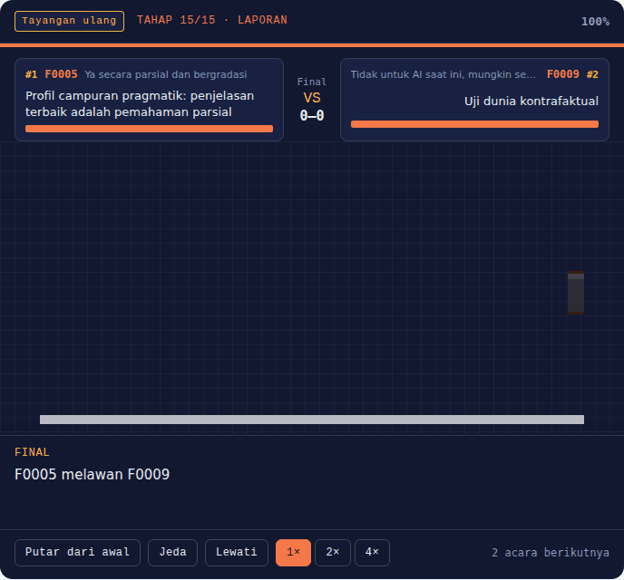
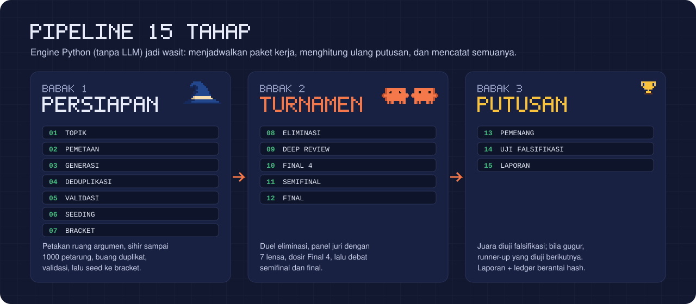
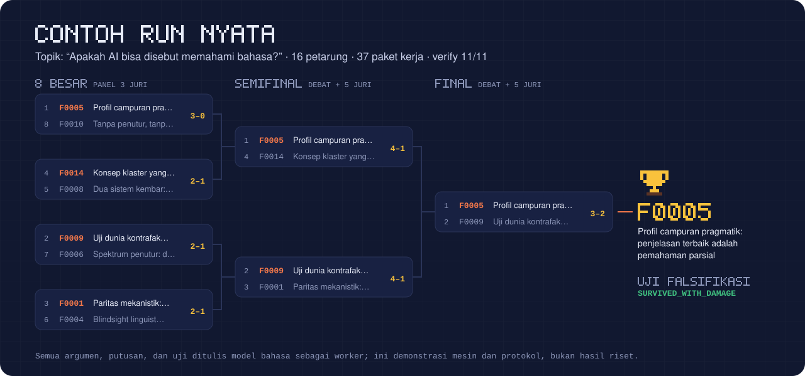

<p align="center">
  
</p>

<p align="center">
  <a href=".claude/skills/argument-battle-royale/SKILL.md"></a>
  
  
  
</p>

<p align="center">
  <a href="https://github.com/kanku-Oiric/Bertahan-Bukan-hidup/releases/download/skill-latest/argument-battle-royale.zip"></a>
</p>

# Bertahan, Bukan Hidup

**Argument Battle Royale** adalah skill Claude Code yang mengubah satu pertanyaan menjadi turnamen argumen. Skill ini memetakan ruang jawabannya, menulis sampai 1000 argumen "petarung", lalu mengadu mereka dalam bracket eliminasi yang dinilai panel juri dengan rubrik 10 kriteria. Juaranya masih harus lolos uji falsifikasi, dan setiap putusan tercatat di ledger yang bisa diverifikasi ulang.

Nama repo ini adalah aturan mainnya: yang menang bukan argumen yang "hidup" atau "benar", tapi argumen yang **bertahan** paling lama di bawah pengujian.

> [!IMPORTANT]
> **Pemenang adalah argumen yang paling tahan terhadap rubrik pengujian yang diterapkan dalam simulasi ini.**
> Kemenangan turnamen tidak pernah disamakan dengan kebenaran final, baik di laporan maupun di jawaban Claude.

```text
/argument-battle-royale "Apakah AI benar-benar memahami bahasa?"
```

## Tonton arenanya

<p align="center">
  
</p>

Setiap duel diputar sebagai pertarungan pixel art. Dua Clawd masuk arena, setiap juri "memukul" dengan **keberatan yang benar-benar dia tulis**, dan bar ketahanan turun sesuai suara panel. Yang kalah KO, pemenang maju di bracket. Rekaman di atas adalah final [contoh run nyata](#contoh-run-nyata) diputar ulang dari `arena.html`.

Arena tampil live selama turnamen berjalan:

| Kamu memakai | Arena muncul di | Pembaruan |
|---|---|---|
| Claude Code di aplikasi desktop, web, atau sesi cloud | Panel samping, sebagai artifact | Setiap babak selesai, tanpa refresh |
| Claude Code CLI di komputer sendiri | `http://localhost:8765` lewat `abr.py serve` | Setiap 3 detik |
| Chat Claude.ai | Artifact di akhir run | Tayangan ulang penuh |

## Mulai cepat

**Di repo ini.** Clone, buka Claude Code di foldernya, lalu panggil skill-nya:

```bash
git clone https://github.com/kanku-Oiric/Bertahan-Bukan-hidup.git
cd Bertahan-Bukan-hidup
claude
```

```text
/argument-battle-royale "Apakah hukuman mati efektif menurunkan kejahatan?" mode=efficient population=200
```

**Di proyek lain.** Salin dua lokasi ini ke proyekmu (atau ke `~/.claude/` agar tersedia di semua proyek):

```text
.claude/skills/argument-battle-royale/    skill, engine, template, referensi
.claude/agents/battle-royale-worker.md    subagent worker (opsional)
```

**Di Claude.ai.** Download [`argument-battle-royale.zip`](https://github.com/kanku-Oiric/Bertahan-Bukan-hidup/releases/download/skill-latest/argument-battle-royale.zip), lalu unggah lewat **Skills → Upload a skill** di Claude.ai.

> [!WARNING]
> Jangan pakai tombol **Code → Download ZIP** di GitHub. Zip itu berisi seluruh repo, jadi `SKILL.md` terkubur di `.claude/skills/argument-battle-royale/` dan Claude.ai menolaknya ("SKILL.md file must be in the top-level folder"). Zip di tautan atas dibangun otomatis dari `main` setiap kali skill berubah. Untuk membuatnya sendiri, jalankan `python3 .github/scripts/package_skill.py`.

Di chat tanpa subagent, semua paket dikerjakan dalam satu percakapan, jadi Claude akan menawarkan 16–32 petarung, bukan 1000.

<details>
<summary><b>Semua parameter</b> (semuanya opsional kecuali topik)</summary>

| Parameter | Default | Keterangan |
|---|---|---|
| `topic` | wajib | Pertanyaan atau topik yang dipertarungkan |
| `mode` | `balanced` | `efficient`, `balanced`, atau `full` |
| `population` | `1000` | Jumlah petarung target (8–5000) |
| `deep_round_threshold` | per mode (16/32/64) | Babak dengan slot sebanyak ini atau kurang memakai panel juri |
| `max_parallel` | `5` | Maksimum worker paralel |
| `random_seed` | turunan hash topik | Menentukan alokasi, pengacakan X/Y, jangkar kalibrasi, pemecah seri |
| `evidence_mode` | `internal` | `internal` atau `web_if_available` |
| `language` | `id` | Bahasa laporan (`id` atau `en`) |
| `output_dir` | `argument-battle-royale-runs/<slug>-<hash>` | Direktori run |
| `resume` | `true` | Lanjutkan run yang sudah ada untuk topik yang sama |

</details>

## Cara kerjanya

<p align="center">
  
</p>

Skill ini memisahkan **wasit** dari **juri**:

- **Wasit** adalah engine Python (`scripts/abr.py`, hanya pustaka standar, tanpa LLM). Engine menyimpan state dan checkpoint, menjadwalkan paket kerja, menghapus duplikat, mengkalibrasi skor, menyusun seeding dan bracket, mengagregasi suara panel, dan menulis ledger berantai hash.
- **Juri dan petarung** adalah Claude, baik subagent paralel maupun Claude sendiri secara berurutan. Setiap tugas adalah satu paket mandiri (`packet.md` menjadi `output.json`) yang divalidasi sebelum diterima.
- **Putusan dihitung ulang dari skor**, bukan dari klaim juri. Urutannya: lebih sedikit cacat fatal menang; kalau sama, total tertimbang lebih tinggi menang; pilihan holistik juri hanya dipakai bila selisihnya di bawah 1 poin.
- **Anti-bias:** posisi X/Y diacak per juri, identitas petarung dianonimkan, dan panel memakai tujuh lensa berbeda: logikawan formal, filsuf sains, analis konseptual, skeptis, metodolog bukti, hakim dialektis, dan generalis.

<details>
<summary><b>Rubrik 10 kriteria</b> (total bobot 100)</summary>

| Kriteria | Bobot |
|---|---:|
| Validitas / kekuatan inferensial | 15 |
| Plausibilitas premis | 15 |
| Kejelasan konseptual | 10 |
| Kecukupan empiris | 10 |
| Keterujian / falsifiabilitas | 10 |
| Ketahanan terhadap kontra-contoh | 10 |
| Daya eksplanatoris | 10 |
| Kejujuran dialektis | 10 |
| Parsimoni | 5 |
| Koherensi dengan pengetahuan latar | 5 |

Definisi, cacat fatal, dan kode diskualifikasi ada di [`references/rubric.md`](.claude/skills/argument-battle-royale/references/rubric.md).

</details>

## Contoh run nyata

<p align="center">
  
</p>

Topiknya *"Apakah AI bisa disebut memahami bahasa?"*, dengan 16 petarung dan 37 paket kerja. Semua argumen, putusan, debat, dan uji di dalamnya ditulis Claude. Hasilnya:

- **Pemenang tahan-uji:** F0005, *Profil campuran pragmatik: penjelasan terbaik adalah pemahaman parsial*. Status falsifikasinya `SURVIVED_WITH_DAMAGE`: satu komitmen bantunya gugur dan pemenang wajib membawa kualifikasi.
- **Final:** F0005 mengalahkan F0009 *Uji dunia kontrafaktual* 3–2, dengan dissent dari logikawan formal dan skeptis.
- Keempat finalis datang dari empat posisi berbeda. Posisi "tidak, secara prinsip" habis di babak 16 besar.

Laporan lengkapnya ada di [`examples/sample-run/report.md`](.claude/skills/argument-battle-royale/examples/sample-run/report.md). Setelah clone, buka `examples/sample-run/arena.html` di browser untuk menonton seluruh turnamennya, lalu cek integritasnya:

```bash
python3 .claude/skills/argument-battle-royale/scripts/abr.py verify \
  --run .claude/skills/argument-battle-royale/examples/sample-run
```

## Clawd juga ikut

<p align="center">
  
</p>

Selama turnamen, Clawd berganti adegan sesuai tahapnya: penyihir saat petarung disihir, duel di bracket, roket saat juara diuji, dan piala di akhir. Adegan ini muncul sebagai flipbook teks di chat, sebagai pixel art berwarna di terminal (`abr.py watch`), dan (opsional) di status line Claude Code.

## Bisa diaudit

`abr.py verify` menjalankan 11 pemeriksaan: rantai hash ledger, output paket yang tidak berubah sejak diserap, populasi yang terkunci sejak seeding, seeding dan bracket yang dihitung ulang, setiap putusan juri dan panel yang dihitung ulang dari skor mentah, kecocokan file ronde dengan ledger, juara sama dengan pemenang final, agregasi falsifikasi, hitungan populasi, dan konsistensi laporan. Kalau satu hasil duel diubah manual, `verify` langsung gagal (ini diuji otomatis).

## Skala dan mode

| Mode | 200 petarung | 1000 petarung | Babak awal diputus oleh |
|---|---:|---:|---|
| `efficient` | ~45 paket | ~80 paket | Skor scouting terkalibrasi, tanpa duel LLM |
| `balanced` | ~80 paket | ~180 paket | Duel LLM ringkas, 1 juri, 20 duel per paket |
| `full` | ~120 paket | ~290 paket | Duel lengkap dengan steelman dan pemeriksaan silang |

Semua state ada di disk, jadi run bisa dilanjutkan kapan saja setelah sesi terputus atau konteks dipadatkan.

<details>
<summary><b>Isi repo</b></summary>

```text
.claude/
├── agents/battle-royale-worker.md          subagent worker
└── skills/argument-battle-royale/
    ├── SKILL.md                            instruksi untuk Claude
    ├── README.md                           dokumentasi lengkap
    ├── scripts/abr.py                      CLI engine (wasit)
    ├── scripts/engine/                     state, bracket, penjurian, laporan, integritas, animasi
    ├── scripts/selftest.py                 uji end-to-end dengan worker sintetis
    ├── templates/                          paket kerja + arena.html
    ├── references/                         pipeline, rubrik, model data, mode
    └── examples/                           contoh input, contoh run nyata, GIF Clawd
.github/readme/                             visual README ini (make_assets.py)
.github/scripts/package_skill.py            zip skill untuk Claude.ai
.github/workflows/skill-package.yml         uji + terbitkan zip ke release skill-latest
```

</details>

## Pengujian

```bash
python3 .claude/skills/argument-battle-royale/scripts/selftest.py
```

Uji ini menjalankan turnamen end-to-end dengan worker sintetis (tanpa LLM) untuk ketiga mode, termasuk skala 1000 petarung. Yang diuji: output yang ditolak lalu diperbaiki, paket yang ditinggalkan, refill petarung, resume dari disk, fallback falsifikasi ke runner-up, arena live, dan deteksi manipulasi.

## Batasan

- Semua penilaian dibuat model bahasa. Pengacakan X/Y, anonimisasi, panel multi-lensa, dan aturan keputusan berbasis skor mengurangi bias juri, tapi tidak menghapusnya.
- Pemenang hanya lebih tahan daripada populasi yang dihasilkan dalam run itu sendiri.
- Rubrik adalah pilihan normatif yang eksplisit, dan bobotnya dicetak di setiap laporan.
- Output LLM tidak deterministik. Reproduksi persis butuh output paket yang tersimpan.

Dokumentasi lengkap skill ada di [`.claude/skills/argument-battle-royale/README.md`](.claude/skills/argument-battle-royale/README.md).

---

<p align="center">
  <a href="https://github.com/kanku-Oiric/Gobyet"></a>
</p>

<p align="center">
  Dikerjakan oleh <a href="https://github.com/kanku-Oiric/Gobyet"><b>Gobyet</b></a> (goblok monyet),<br>
  monyet bodoh yang lagi larping jadi programmer. Dibuat buat have fun.
</p>
